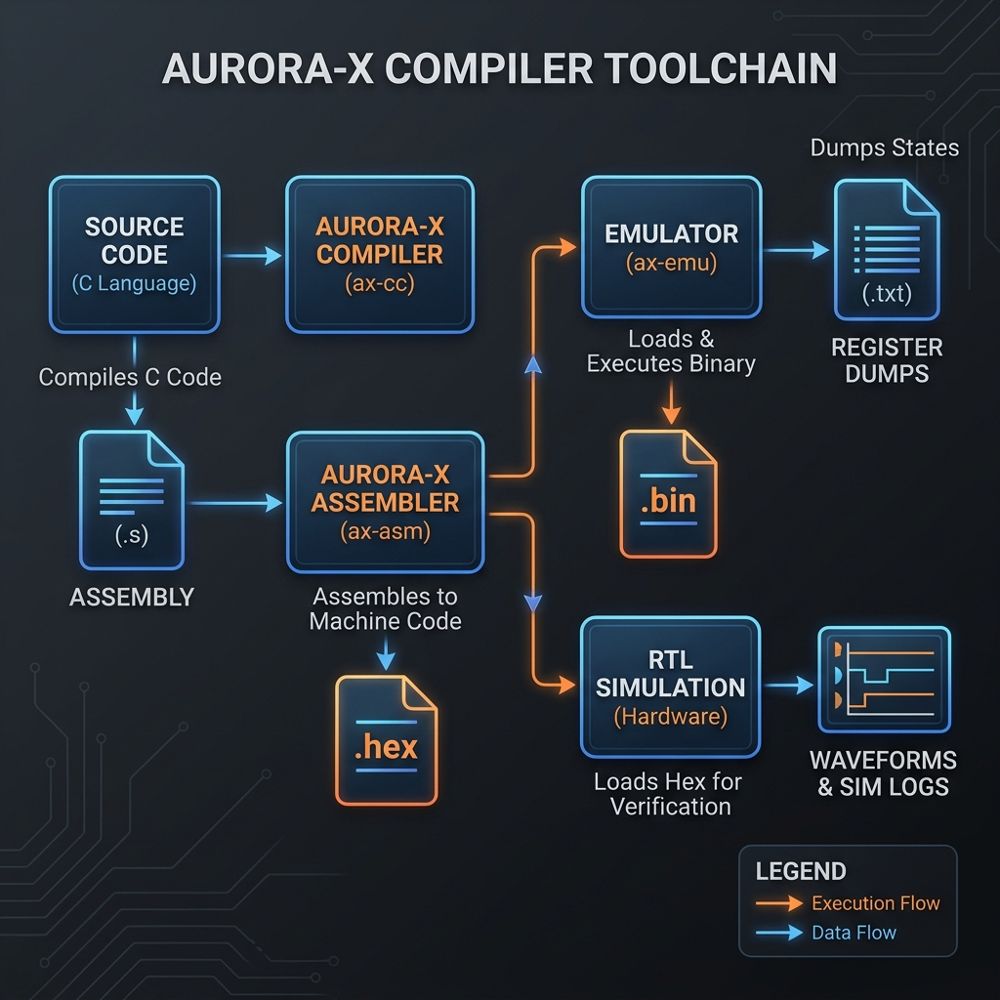

# Getting Started with AURORA-X

Welcome to the **AURORA-X** developer and user guide! This document provides step-by-step instructions to set up your environment, build the compiler and simulator toolchain, run software demo programs, and execute cycle-accurate hardware simulations.

---

## 🛠️ Prerequisites & Installation

Before starting, ensure you have the following tools installed on your system:

1. **Rust Toolchain:**
   - Required to build the compiler, assembler, emulator, and disassembler.
   - Install Rust via [rustup](https://rustup.rs/):
     ```bash
     curl --proto '=https' --tlsv1.2 -sSf https://sh.rustup.rs | sh
     ```
2. **Verilog Simulator:**
   - Required to compile and simulate the hardware RTL.
   - Recommended: **Icarus Verilog (iverilog)** and **vvp**.
   - On Windows: Download the installer from [bleyer.org](http://bleyer.org/icarus/) (ensure you check "Add to executable path").
   - On Linux/macOS:
     ```bash
     sudo apt-get install iverilog  # Ubuntu/Debian
     brew install icarus-verilog    # macOS
     ```

---

## 💻 1. Software Toolchain Workflow

The AURORA-X software toolchain is written in Rust and is located under `aurora-x-tools/`. It contains:
- **`ax-cc`**: C Compiler (subset of C -> AURORA-X Assembly `.s`)
- **`ax-asm`**: Assembler (Assembly `.s` -> Machine Binary `.bin` / Hex `.hex`)
- **`ax-emu`**: Cycle-accurate CPU/System Emulator
- **`ax-disasm`**: Disassembler (Machine Binary `.bin` -> Assembly `.s`)

### Toolchain Flow Diagram



### Step-by-Step Compilation and Execution

Let's compile and run the Fibonacci C demo program.

#### Step A: Build the Toolchain
Build all crates in the workspace in debug mode (or add `--release` for optimized builds):
```bash
cd aurora-x-tools
cargo build --workspace
```

#### Step B: Compile C Code to Assembly
Use `ax-cc` to compile `fib.c` into `fib.s` assembly:
```bash
cargo run -p ax-cc -- ../AURORA-X-Tests/fib.c -o fib.s
```
*Output:*
```text
Compilation complete. Output written to fib.s
```

#### Step C: Assemble to Binary & Hex
Use `ax-asm` to convert assembly instructions into machine binary and ASCII hex formats:
```bash
cargo run -p ax-asm -- fib.s -o fib.bin
```
*Output:*
```text
Line 1: PC=0000 09C8000A - ADDI R25, R0, 10
Line 2: PC=0004 090E4000 - ADDI R1, R25, 0
...
Assembly complete. Resolving 0 labels. Binary written to fib.bin, Hex written to fib.hex
```

#### Step D: Run on Emulator
Execute the compiled binary on the `ax-emu` virtual machine:
```bash
cargo run -p ax-emu -- fib.bin
```
*Output:*
```text
Starting execution...
[AX-EMU] SYS_PRINT: 55
Infinite loop detected at PC=0x88. Halting emulator.
Execution complete.
--- Hardware State Dump ---
R5  (VL)      = 0
R12 (XOR)     = 0
R13 (SHL)     = 0
R15 (MMU Ld)  = 0
R20 (CAUSE)   = 0
R21 (EPC)     = 0
AX_EPC (0x018)   = 0
AX_CAUSE (0x008) = 0
Mem[108] (Cause) = 704813342770331651
```

---

## 🏗️ 2. Hardware RTL Simulation

The hardware implementation of the AURORA-X dual-core pipelined SoC is written in synthesizable Verilog and located under `aurora-x-hardware/`.

### Run Multi-Core Simulation Testbench

To test multicore arbitration and cache synchronization, execute the following commands in the `aurora-x-hardware` directory:

#### Step A: Compile Verilog RTL with Iverilog
Compile all hardware modules and the testbench:
```bash
cd aurora-x-hardware
iverilog -o soc_sim.vvp tb_aurora_x_soc.v aurora_x_soc.v aurora_x_core.v ax_bus_scalable.v l1_cache.v l2_cache.v l3_cache.v mmu.v bpu.v vector_alu.v vector_register_file.v register_file.v decoder.v hazard_unit.v forwarding_unit.v alu.v ax_clint.v ax_uart.v ax_pmu.v ax_gpio.v ax_spi.v ax_fpu.v
```

#### Step B: Execute the Simulation
Run the simulation loaded with the multicore program hex file using `vvp`:
```bash
vvp soc_sim.vvp +TEST=../AURORA-X-Tests/test_multicore.hex
```
*Expected Output:*
```text
VCD info: dumpfile aurora_x_soc.vcd opened for output.
WARNING: tb_aurora_x_soc.v:106: $readmemh(../AURORA-X-Tests/test_multicore.hex): Not enough words in the file for the requested range [0:1023].
Time=45000 | Core  0 | PC=0000000000000000 | ALU_Op=0000 | in1=                   0 | in2=                   0 | res=                   0 | rd= 1
Time=55000 | Core  0 | PC=0000000000000000 | ALU_Op=0000 | in1=                   0 | in2=                   0 | res=                   0 | rd= 1
Time=60000 | Core  1 | PC=0000000000000000 | ALU_Op=0000 | in1=                   0 | in2=                   0 | res=                   0 | rd= 1
...
Time=260000 | Core  1 | PC=0000000000000028 | ALU_Op=0000 | in1=                4096 | in2=                   0 | res=                4096 | rd= 3
========================================
 [MULTI-CORE HARDWARE PASS] 
 Core 0 Final Read = 0x0000000000000001
========================================
tb_aurora_x_soc.v:130: $finish called at 275000 (1ps)
```

During simulation, it will generate a Value Change Dump (`aurora_x_soc.vcd`) which can be opened in **GTKWave** to view signal waveforms for clocks, registers, caches, and the system bus.

---

## 🧪 3. Running Automated Tests

A comprehensive suite of test programs validates the compiler output against the instruction execution engine in the emulator.

To run all automated compliance tests:
1. Navigate to `AURORA-X-Tests/`.
2. Run the automated test script:
   ```bash
   cd AURORA-X-Tests
   Run-Tests.bat
   ```
*Output:*
```text
========================================
 AURORA-X Automated Compliance Suite
========================================

[RUNNING] test_alu.s...
  [PASS]  test_alu.s
[RUNNING] test_branch.s...
  [PASS]  test_branch.s
[RUNNING] test_branch_full.s...
  [PASS]  test_branch_full.s
[RUNNING] test_exceptions.s...
  [PASS]  test_exceptions.s
[RUNNING] test_fpu.s...
  [PASS]  test_fpu.s
[RUNNING] test_memory.s...
  [PASS]  test_memory.s
[SKIPPED] test_mesi.s [Multicore Snoop Test - requires Hardware simulation]
[RUNNING] test_muldiv.s...
  [PASS]  test_muldiv.s
[RUNNING] test_multicore.s...
  [PASS]  test_multicore.s
[RUNNING] test_pmu.s...
  [PASS]  test_pmu.s
[RUNNING] test_r0.s...
  [PASS]  test_r0.s
[RUNNING] test_slt_sra.s...
  [PASS]  test_slt_sra.s
[RUNNING] test_vcmp_mask.s...
  [PASS]  test_vcmp_mask.s
[RUNNING] test_vector.s...
  [PASS]  test_vector.s

=======================================
 RESULTS: 13 PASSED, 0 FAILED
=======================================
```

### Running C Compiler End-to-End Tests

To verify the full software toolchain pipeline (compiling C source to assembly, assembling to binary, and executing on the emulator), run the End-to-End test suite:
1. Navigate to `AURORA-X-Tests/`.
2. Run the automated E2E test script:
   ```bash
   cd AURORA-X-Tests
   Run-E2E-Tests.bat
   ```
*Output:*
```text
========================================
 AURORA-X C Compiler End-to-End Suite
========================================

[RUNNING] demo.c...
  [PASS]  demo.c
[RUNNING] fib.c...
  [PASS]  fib.c
[RUNNING] test_features.c...
  [PASS]  test_features.c
[RUNNING] test_large_const.c...
  [PASS]  test_large_const.c

========================================
 RESULTS: 4 PASSED, 0 FAILED
========================================
```
```

---

## 🚀 4. Running Demos (Vector & AI Math)

A set of demos are located in `AURORA-X-Demos/` to showcase vector and exception processing. 

### Run AI Polynomial Demo
This demo uses the 2048-bit wide vector registers and SIMD multiply-add logic to calculate polynomial equations.
```bash
cd AURORA-X-Demos
Run-Demo.bat 03_AI_Polynomial.s
```
This script will automatically:
1. **Assemble** the file using `ax-asm`.
2. **Emulate** the execution on `ax-emu`.
3. **Disassemble** the output binary using `ax-disasm`.
