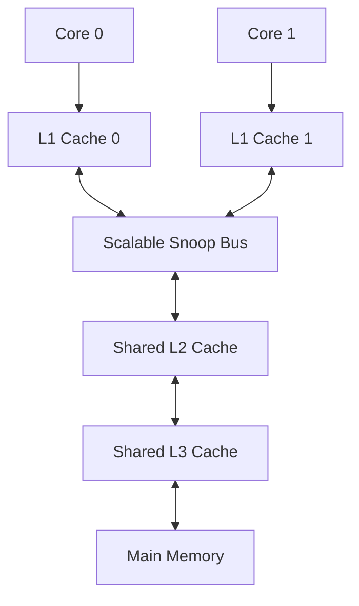

# AURORA-X Hardware RTL & SoC Architecture

This document describes the hardware design, module implementations, and System-on-Chip (SoC) microarchitecture of the **AURORA-X v1.9** processor.

---

## 1. SoC System Layout

AURORA-X is implemented as a dual-core SoC with a hierarchical memory subsystem, a scalable interconnect bus, power management, and essential peripherals.

### SoC Architecture Diagram

### Key SoC Features
- **Processor Cores:** Two symmetric, 5-stage pipelined execution cores (`Core 0` and `Core 1`).
- **Memory Coherency:** MESI protocol implemented across L1 caches via a shared snoop bus.
- **Hierarchical Cache:** Low-latency split L1, shared L2, and massive L3 cache system.
- **Arbitration Bus:** An asynchronous system bus (`ax_bus_scalable.v`) that grants round-robin memory access and broadcasts invalidate signals.
- **Power Controller:** Dedicated Power Management Unit (PMU) for frequency division and clock gating.

---

## 2. 5-Stage Pipelined Core

The heart of the processor is a high-frequency **5-Stage Pipelined Processor Core** (`aurora_x_core.v`). 

### Pipeline Stage Diagram

### Pipeline Stages
1. **Instruction Fetch (IF):**
   - Fetches instructions from L1 Instruction Cache using the Program Counter (PC).
   - Incorporates a **Branch Prediction Unit (BPU)** to predict branch targets.
2. **Instruction Decode (ID):**
   - Translates 32-bit instructions into pipeline control signals.
   - Reads registers from the General Purpose (`register_file.v`) and Vector (`vector_register_file.v`) register files.
3. **Execute (EX):**
   - Perform scalar integer operations via `alu.v`, vector SIMD calculations via `vector_alu.v`, and floating-point math via `ax_fpu.v`.
   - Resolves target addresses for jumps and branches.
4. **Memory Access (MEM):**
   - Performs memory reads and writes to L1 Data Cache.
   - Accesses Memory Management Unit (`mmu.v`) for virtual-to-physical address translation.
5. **Write-back (WB):**
   - Writes register results back to the register files.

### Hazard & Forwarding Units
- **Forwarding Unit (`forwarding_unit.v`):**
   - Eliminates data hazards by routing execution results directly from the EX/MEM or MEM/WB pipeline registers back to the ALU inputs, avoiding stalls.
   - Supports 0-cycle forwarding for Control and Status Register (CSR) reads.
- **Hazard Unit (`hazard_unit.v`):**
   - Detects load-use hazards (when an instruction immediately following a memory load depends on its value) and inserts a single-cycle stall.
   - Flushes the pipeline stages (IF/ID and ID/EX) when a branch prediction is incorrect.

---

## 3. Cache Subsystem & Cache Coherency

The memory architecture utilizes a three-tier cache structure to maximize data throughput:

### L1 Snoop Cache (`l1_cache.v`)
- Each core owns a private, split Instruction and Data L1 cache (64-byte line size).
- The L1 Data cache monitors (snoops) the system bus. When a core writes to a shared cache line, the bus broadcasts an invalidate signal, and the other L1 cache invalidates its corresponding line (MESI protocol).

### Shared L2 Cache (`l2_cache.v`)
- Multi-way cache shared between cores.
- Employs a **Write-allocate / Write-back** policy to minimize slow writes to higher-level memories.

### Shared L3 Cache (`l3_cache.v`)
- Configurable cache block representing a massive SRAM pool (e.g. 16MB standard, or 64MB when 3D V-Cache is enabled).
- Replaced slow Modulo operations with Bit Masking to allow silicon synthesis:
  `wire [31:0] index = (bus_addr >> 3) & (CACHE_LINES - 1);`

---

## 4. Power & Interrupt Controllers

### Power Management Unit (`ax_pmu.v`)
The PMU controls core power states to optimize efficiency:
- **Dynamic Frequency Scaling:** Uses clock dividers synchronized to the negative edge of the system clock to safely adjust the operating frequency of the cores without inducing clock glitches.
- **Clock Gating:** Disables the clock output to idle cores (`core_en = 0`) to eliminate dynamic power consumption.

### Core Local Interrupt Controller (`ax_clint.v`)
The CLINT handles core timer interrupts (`timer_intr`) and software interrupts (`sw_intr`):
- Features real-time counters.
- Generates system timer ticks for cooperative and preemptive multitasking runtime environments.
