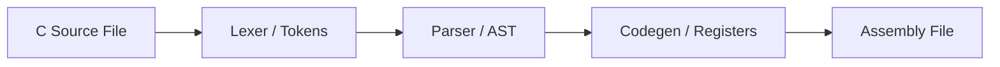

# AURORA-X Software Ecosystem & Toolchain

This document details the architecture and implementation of the Rust-based software toolchain for the **AURORA-X v1.9** platform. The toolchain is located under the `aurora-x-tools/` directory.

---

## 1. C Compiler Backend (`ax-cc`)

The `ax-cc` tool compiles a subset of the C programming language into AURORA-X assembly (`.s`).



### Compiler Architecture
1. **Lexical Analysis (`lexer.rs`):** Converts the character stream of the source file into structured tokens (e.g., keywords like `if`, `while`, operators, identifiers).
2. **Parsing (`parser.rs`):** Constructs an Abstract Syntax Tree (AST) mapping variable declarations, assignments, arithmetic expressions, loops, and conditions.
3. **Code Generation (`codegen.rs`):** Traverses the AST and emits assembly instructions.

### Register Allocation & Safety
To prevent register clobbering, the compiler divides registers into two pools:
- **Variable Allocation Pool (`R1` - `R24`):** Assigned permanently to variables declared in the C code.
- **Temporary Register Stack (`R25` - `R31`):** Reserved for evaluating intermediate arithmetic results.

#### Nested Expression Evaluation
During recursive AST traversal for expressions (e.g. `(a + b) * (c + d)`), the compiler manages a dynamic register pointer `temp_idx`. This acts as a compile-time stack:
- Evaluating `a + b`: Uses `R25` and `R26`. The result is saved in `R25`.
- Evaluating `c + d`: Increments the pointer to use `R26` and `R27`. The result is saved in `R26`.
- Multiplying the sub-results: Evaluates `R25 * R26` and writes the final result back to `R25`.
This stack architecture prevents nested expressions from overwriting each other's temporary registers.

---

## 2. Assembler (`ax-asm`)

The `ax-asm` tool processes assembly `.s` source files and outputs machine instructions in two file formats:
- **`.bin` (Raw Binary File):** Stream of 32-bit machine instruction words used by the emulator.
- **`.hex` (ASCII Hex File):** Text representations of the 32-bit words, formatted for Verilog simulators via the `$readmemh` system task.

### Multi-Pass Translation
- **Pass 1 (Tokenization & Instruction Translation):** Reads instructions, decodes register names, and matches opcodes. It builds a **Symbol Table** containing the addresses of branch and jump labels.
- **Pass 2 (Label Resolution & Output):** Iterates over the translated instructions, computes relative PC offsets for conditional branches and jump instructions using the symbol table, and encodes them into final 32-bit binary words.

---

## 3. Simulator & Emulator (`ax-emu`)

The `ax-emu` tool is a cycle-accurate CPU simulator. It loads a `.bin` binary file into a virtual memory space and emulates CPU execution line-by-line.

### Execution Loop
```rust
loop {
    let inst = mem.read_u32(cpu.pc); // Fetch
    let dec = decoder::decode(inst);  // Decode
    executor::execute(&mut cpu, &mut mem, &dec); // Execute
    cpu.pc += 4;
}
```

### System Call & Output Simulation
The emulator intercepts specific operations to perform environment interactions:
- **Console Printing (`0x701` CSR):** When the CPU executes a `CSR.WRITE` to address `0x701`, the emulator intercepts it and prints the numeric value of the operand register to the host console prefixing it with `[AX-EMU] SYS_PRINT: `.
- **Test Exit Status (`0x700` CSR):** In test execution mode (`--test`), writing `1` to CSR `0x700` terminates the simulator with exit code `0` (success), whereas writing `2` terminates with exit code `1` (failure).
- **Infinite Loop Protection:** If the target PC equals the current PC, the simulator detects an infinite stall. In test mode, this causes an immediate failure exit.

---

## 4. Disassembler (`ax-disasm`)

The `ax-disasm` tool decodes `.bin` raw binary files back into assembly instruction listings.

### DRY Code Architecture
To avoid repeating opcode decode logic across the assembler, simulator, and disassembler, the decoding logic is housed in a shared library module (`ax-emu/src/lib.rs`). 

`ax-disasm` imports this shared crate:
- Reads 32-bit instruction words sequentially.
- Passes them to the shared `decoder::decode(word)` function.
- Formats the resulting instruction struct (containing `opcode`, `rd`, `rs1`, `rs2`, `imm`, `funct9`, etc.) into structured assembly text (e.g. `ADDI R5, R2, 10`).
- Dumps the result to the console or an output file.
